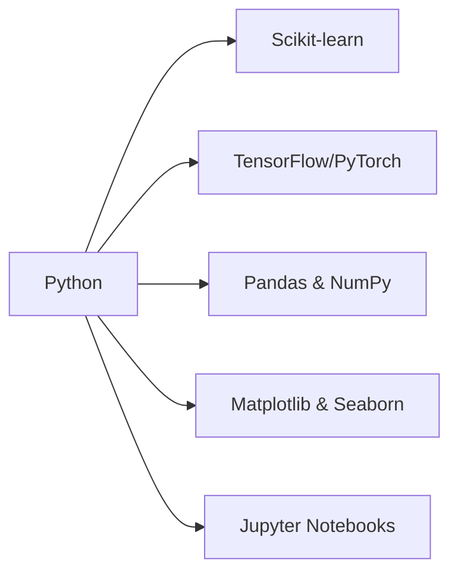

# 🚀 Epti Ara Era | ML Enthusiast & Python Developer

```python
# 🧠 Neural Network in Progress...
class EptiEra:
    def __init__(self):
        self.name = "Epti Ara Era"
        self.role = "Computer Science Student"
        self.passion = "Machine Learning & AI"
        self.language = "Python"
        self.status = "Learning & Growing 🚀"
    
    def learn_ml(self):
        return "Exploring the fascinating world of algorithms!"
```

## 🎯 What I'm Building

- **🤖 ML Models** - From simple linear regression to neural networks
- **📊 Data Science Projects** - Turning raw data into insights
- **🔬 Research & Experimentation** - Testing new algorithms and approaches
- **🌐 Real-world Applications** - Solving practical problems with ML

## 🛠️ Tech Stack



## 🚀 Current Projects

| Project | Status | Tech Used |
|---------|--------|-----------|
| 🔍 **Data Explorer** | 🟡 In Progress | Pandas, Matplotlib |
| 🧠 **Neural Network Playground** | 🟢 Active | TensorFlow, NumPy |
| 📈 **ML Algorithm Visualizer** | 🟡 Planning | Scikit-learn, Plotly |

## 📚 Learning Path

```
🎯 2024 Goals:
├── Master Deep Learning fundamentals
├── Build 5+ ML projects
├── Contribute to open-source ML libraries
└── Participate in Kaggle competitions
```

## 🌟 What Makes Me Unique

- **🎨 Creative Problem Solver** - I approach ML challenges with artistic thinking
- **🔬 Experimental Mindset** - Always testing new approaches and algorithms
- **📖 Knowledge Sharer** - Love documenting and sharing what I learn
- **🌍 Real-world Focus** - Building solutions that actually matter

## 🎮 Fun Facts

- 🎵 I code to the rhythm of algorithms
- 🌙 Late-night debugging sessions are my jam
- ☕ Coffee + Python = Perfect debugging duo
- 🎯 My goal: Make AI accessible to everyone

## 📫 Let's Connect!

[](https://linkedin.com/in/yourprofile)
[](https://twitter.com/yourhandle)
[](https://kaggle.com/yourprofile)

---

<div align="center">
  
  
</div>

<div align="center">
  
</div>

---

> *"In the world of Machine Learning, every dataset tells a story, and every algorithm is a new adventure waiting to be explored."* 🚀

<div align="center">
  
</div>
