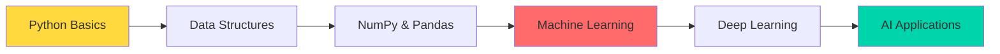

# 

# 🚀 **Epti Ara Era** | ML Enthusiast & Python Developer

<div align="center">
  
  [](https://python.org)
  [](https://tensorflow.org)
  [](https://pandas.pydata.org)
  [](https://openai.com)
  
</div>

---

## 🧠 **About Me**

```python
class EptiAraEra:
    def __init__(self):
        self.name = "Epti Ara Era"
        self.role = "Computer Science Student"
        self.passion = "Machine Learning & AI"
        self.location = "🌍 Earth"
        self.status = "🚀 Learning & Growing"
    
    def current_focus(self):
        return [
            "🤖 Machine Learning with Python",
            "📊 Data Science & Analytics", 
            "🧮 Algorithm Development",
            "🔬 Real-world ML Applications"
        ]
    
    def learning_path(self):
        return "Exploring the fascinating world of AI, one algorithm at a time!"
```

---

## 🛠️ **Tech Arsenal**

### **Core Languages & Tools**


### **ML & Data Science Stack**


---

## 📈 **Learning Journey**



---

## 🎯 **Current Projects & Goals**

- 🔬 **Algorithm Explorer**: Building ML models from scratch
- 📊 **Data Detective**: Analyzing real-world datasets
- 🤖 **AI Experimenter**: Testing cutting-edge ML techniques
- 🚀 **Project Builder**: Creating practical ML solutions

---

## 🌟 **What Makes Me Unique**

- 🎨 **Creative Problem Solver**: Finding innovative approaches to ML challenges
- 🔍 **Detail-Oriented**: Ensuring every model is optimized and efficient
- 📚 **Continuous Learner**: Always exploring new ML techniques and libraries
- 🌍 **Real-World Focus**: Building solutions that solve actual problems

---

## 📊 **GitHub Stats**

<div align="center">
  
  
  
  
  
</div>

---

## 🚀 **Let's Connect & Collaborate!**

<div align="center">
  
  [](https://linkedin.com/in/eptiera)
  [](https://twitter.com/eptiera)
  [](mailto:eptiera@example.com)
  
</div>

---

## 💡 **Favorite ML Quote**

> *"Machine learning is the next internet."* - **Tony Tether**

---

<div align="center">
  
  ### 🎯 **Ready to build the future with AI!**
  
  
  
</div>
