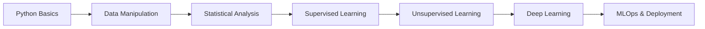

# 🧠 Machine Learning Enthusiast | Python Developer

---

## 🚀 About Me

I'm a **Computer Science student** passionate about unlocking the power of data through **Machine Learning**, **Artificial Intelligence**, and **Data Science**. Currently diving deep into the world of algorithms and real-world applications that transform raw data into meaningful insights.

---

## 🎯 What I'm Currently Exploring

- **🤖 Machine Learning Algorithms** - From classic to cutting-edge
- **🐍 Python Ecosystem** - TensorFlow, PyTorch, Scikit-learn, Pandas
- **📊 Data Visualization** - Matplotlib, Seaborn, Plotly
- **🔬 Neural Networks & Deep Learning** - Building intelligent systems
- **📈 Real-world ML Applications** - Solving practical problems with data

---

## 🛠️ Tech Stack

### **Languages & Frameworks**

### **ML & Data Science**

### **Tools & Platforms**

---

## 🎨 Current Projects

### **🔍 ML Project Explorer**
- **Neural Network Visualizer** - Interactive visualization of neural network architectures
- **Algorithm Playground** - Testing and comparing different ML algorithms
- **Data Storyteller** - Converting complex datasets into compelling narratives

---

## 📚 Learning Path

---

## 🌟 What Makes Me Unique

- **🎭 Creative Problem Solver** - Finding innovative ways to approach ML challenges
- **🔬 Research Mindset** - Always questioning and exploring new methodologies
- **💡 Practical Application** - Focus on real-world impact, not just theory
- **🚀 Fast Learner** - Adapting to new technologies and frameworks quickly

---

## 📊 GitHub Stats

---

## 🎯 Goals for 2024

- [ ] **Master Deep Learning** - Build and deploy neural networks
- [ ] **Contribute to Open Source** - Give back to the ML community
- [ ] **Build ML Portfolio** - Create impactful projects
- [ ] **Learn MLOps** - Understand production deployment
- [ ] **Network & Collaborate** - Connect with fellow ML enthusiasts

---

## 🤝 Let's Connect!

I'm always excited to:
- **Collaborate** on interesting ML projects
- **Learn** from experienced developers
- **Share** knowledge and discoveries
- **Build** something amazing together

---

## 💭 Favorite ML Quote

> *"Machine learning is the last invention that humanity will ever need to make."* - Nick Bostrom

---

## 🎮 Fun Fact

When I'm not training models, you'll find me exploring the fascinating intersection of **AI ethics**, **quantum computing**, and **neuroscience-inspired algorithms**.

---

*Ready to turn data into intelligence! 🚀*

<!--
**eptiera/eptiera** is a ✨ _special_ ✨ repository because its `README.md` (this file) appears on your GitHub profile.
-->
